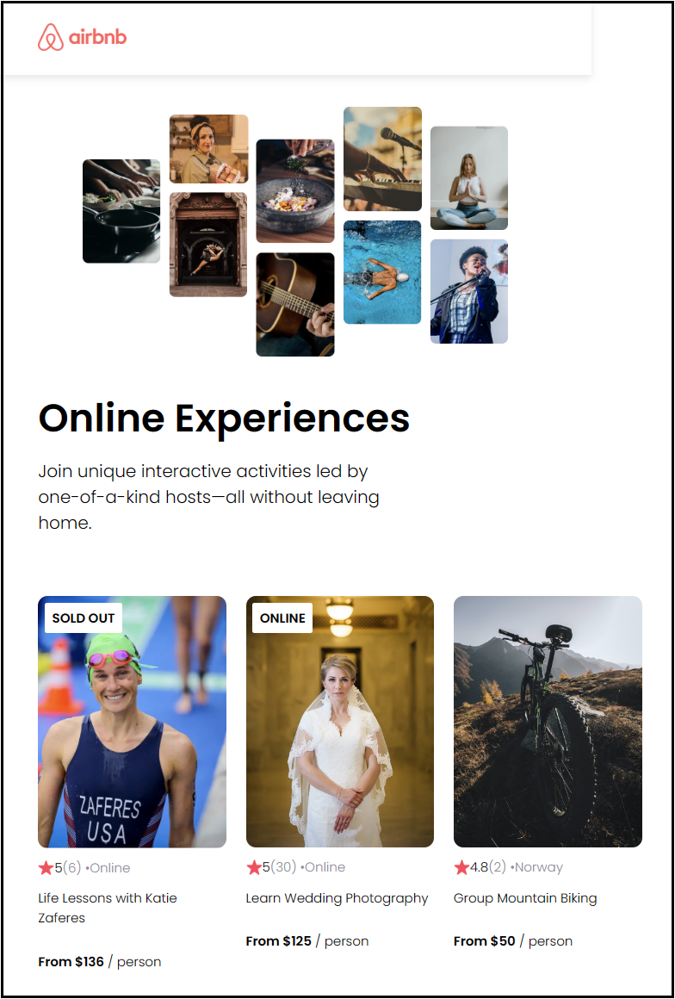

# Airbnb clone

## Description
This app is an exercise in data-driven React. 

The texts and images in an array of objects are passed as props to the Cards at the bottom of the page.

 

## Technologies
- HTML
- CSS
- JavaScript
- React

## Live link
The application is deployed here:
[https://toms-airbnb.netlify.app](https://toms-airbnb.netlify.app)

Please feel free to click around and explore!
